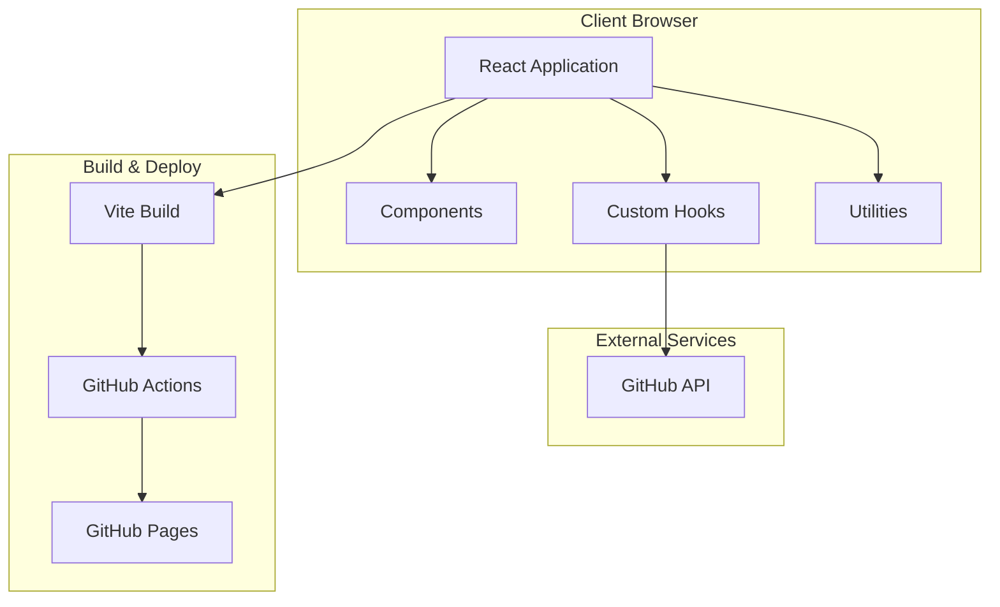
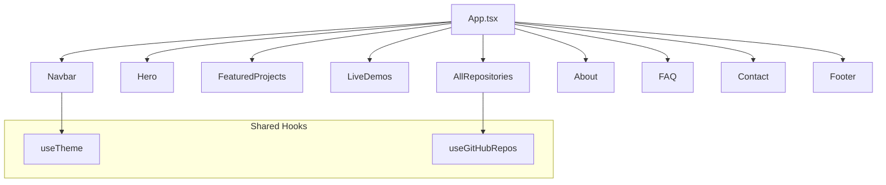
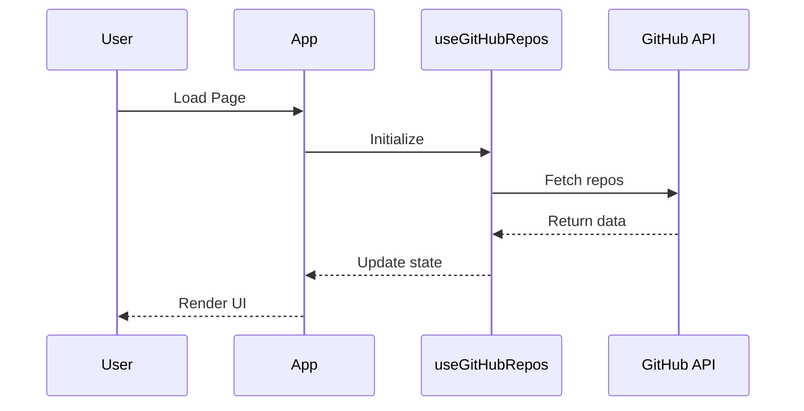
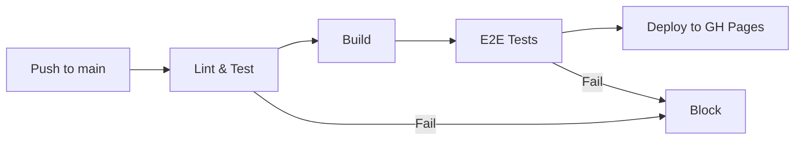

# Architecture Documentation

This directory contains high-level system architecture documentation including diagrams, patterns, and structural decisions.

## Purpose

Architecture documentation provides:

1. **System Overview**: Visual understanding of how components interact
2. **Pattern Reference**: Established patterns to follow for consistency
3. **Onboarding Aid**: Helps new agents understand the system quickly
4. **Decision Context**: Explains why the system is structured this way

## Contents

### System Diagrams

Architecture diagrams use [Mermaid.js](https://mermaid.js.org/) for version-controlled, text-based diagrams.

#### High-Level Architecture



#### Component Architecture



#### Data Flow



#### CI/CD Pipeline



## Architecture Patterns

### 1. Component-Based Architecture

React components follow single-responsibility principle:

```
Component
├── Props Interface (typed)
├── State Management (hooks)
├── Event Handlers
└── Render Logic
```

### 2. Custom Hooks Pattern

Business logic is extracted into reusable hooks:

```typescript
// Pattern: useFeature hook
function useFeature() {
  const [data, setData] = useState();
  const [loading, setLoading] = useState(true);
  const [error, setError] = useState(null);
  
  // Side effects
  useEffect(() => { /* ... */ }, []);
  
  return { data, loading, error };
}
```

### 3. Utility Functions

Pure functions in `lib/` directory:

```typescript
// Pure, testable, single-purpose
export function formatDate(date: Date): string {
  return date.toLocaleDateString();
}
```

### 4. Type-First Development

All code is TypeScript with strict mode:

```typescript
// Define types before implementation
interface Repository {
  id: number;
  name: string;
  description: string | null;
  stars: number;
  language: string | null;
}
```

## Layer Responsibilities

| Layer | Responsibility | Location |
|-------|---------------|----------|
| Components | UI rendering | `src/components/` |
| Hooks | State & logic | `src/hooks/` |
| Utilities | Pure functions | `src/lib/` |
| Types | Type definitions | `src/types/` |
| Tests | Quality assurance | `src/__tests__/`, `e2e/` |

## Key Decisions

Major architectural decisions are documented in [ADR/](../ADR/):

- [ADR-0001: Initial Tech Stack](../ADR/0001-initial-tech-stack.md)

## Constraints

### Technical Constraints

1. **Static Hosting**: GitHub Pages - no server-side code
2. **API Rate Limits**: GitHub API - 60 requests/hour unauthenticated
3. **Bundle Size**: Keep reasonable for fast loading
4. **Browser Support**: Modern browsers (last 2 versions)

### Design Constraints

1. **Mobile-First**: Responsive design required
2. **Theme Support**: Light and dark modes
3. **Accessibility**: WCAG 2.1 AA compliance

## Scaling Considerations

Current architecture supports:

- ✅ Additional sections/pages
- ✅ More GitHub integrations
- ✅ New themes/styling
- ✅ Additional animations

Would require changes for:

- ⚠️ Server-side features
- ⚠️ User authentication
- ⚠️ Database storage
- ⚠️ Real-time features

## Related Documentation

- [PRD.md](../PRD.md) - Product requirements
- [DESIGN.md](../DESIGN.md) - Design system
- [ARCHITECTURE.md](../ARCHITECTURE.md) - Detailed architecture
- [ADR/](../ADR/) - Decision records
