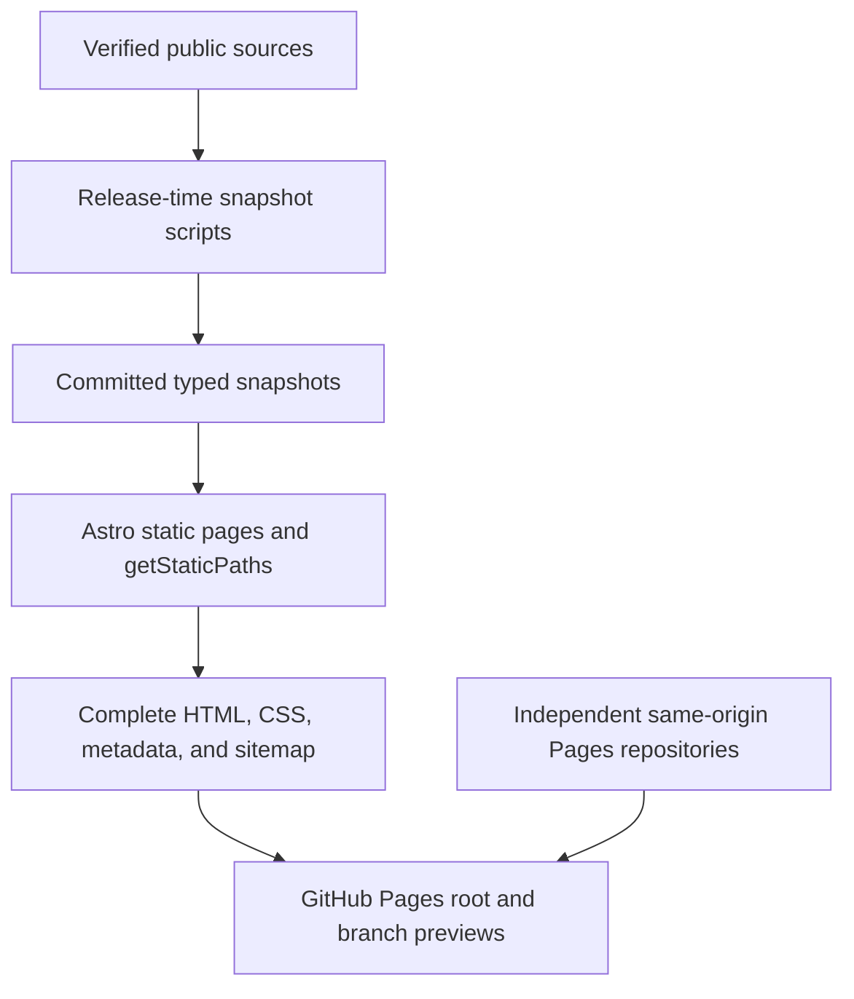

# Architecture documentation

The canonical system description is [ARCHITECTURE.md](../ARCHITECTURE.md). Architectural decisions live in [ADR](../ADR/).

## High-level architecture

```mermaid
graph TB
    Public[Verified public sources] --> Snapshot[Release-time snapshot scripts]
    Snapshot --> Data[Committed typed snapshots]
    Data --> Astro[Astro static pages and getStaticPaths]
    Astro --> HTML[Complete HTML, CSS, metadata, and sitemap]
    HTML --> Pages[GitHub Pages root and branch previews]
    Siblings[Independent same-origin Pages repositories] --> Pages
```

## Layers

| Layer | Responsibility | Location |
| --- | --- | --- |
| Components | Shared static presentation | `src/components/` |
| Data | Curated records and dated snapshots | `src/data/` |
| Layouts | Document shell, navigation, metadata, JSON-LD | `src/layouts/` |
| Utilities | URLs, formatting, and schema construction | `src/lib/` |
| Pages | Canonical routes, redirect stub, sitemap | `src/pages/` |
| Tests | Container rendering and browser contracts | `src/__tests__/`, `e2e/` |

Primary content, navigation, and fallbacks do not require JavaScript. React is reserved for optional progressive enhancement. See ADR-0002 and ADR-0003 for the rendering, styling, and deployment decisions.
